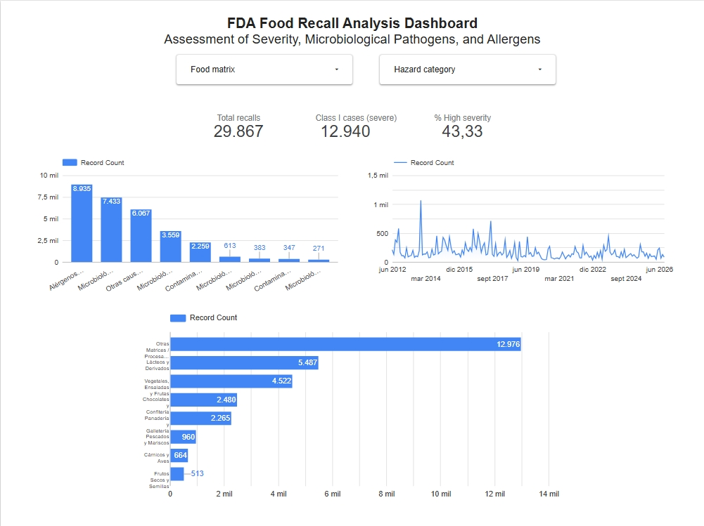

# FDA Food Recalls & Risk Analysis (2012–2026)

An end-to-end data analytics project evaluating 29,800+ FDA enforcement records to assess contamination hazards, pathogen trends, and regulatory compliance. Built with Google BigQuery and Looker Studio.

---

## Project Overview

Food recalls are among the most critical events in food manufacturing—they directly impact consumer safety, damage brand trust, and create substantial supply chain liabilities. 

Using historical enforcement data from the U.S. Food and Drug Administration (FDA) between 2012 and 2026, I built an analytical pipeline to explore the core drivers behind food recalls in the United States. 

The goal of this project was to look beyond raw numbers and compare two very different types of failure: high-volume operational oversights (such as packaging and allergen labeling errors) versus low-volume, high-severity microbiological threats (such as *Listeria monocytogenes* and *Salmonella*).

---

## Key Questions Explored

* **Volume vs. Severity:** What proportion of total recalls pose life-threatening hazards (Class I), and what primarily drives them?
* **Product Matrix Risks:** Which food categories (fresh produce, dairy, bakery, confectionery) show the highest frequency of biological contamination?
* **Longitudinal Trends:** How has recall frequency evolved over time, and do we observe recurring spikes or steady baselines across the 2012–2026 window?

---

## Tools 

Google BigQuery (Standard SQL): Staged, cleaned, and transformed the raw enforcement dataset. Extracted date values, filtered product divisions, and used SQL conditional logic to classify root causes and food matrices.
Google Looker Studio:Built an interactive reporting dashboard with dynamic filters, KPI scorecards, and categorical distributions for intuitive exploration.
GitHub: Version control and technical documentation.

Build pathway Raw FDA Open Data 

Google BigQuery: Cleaning & Filtering 
Filter to Food/Cosmetics division
Parse string dates into standard DATE format

Google BigQuery: Feature Modeling 
Categorize root causes (Allergens, Pathogens, Foreign Matter)
Group product descriptions into defined food categories
Add severity flags for Class I ratio analysis

Looker Studio Dashboard 
Interactive filters (Food Matrix, Hazard Category)
KPI scorecards and visual trend tracking

## Key Findings

* **43.1% of recalls represent critical hazards:** Out of 29,867 recorded food recalls, 12,940 were designated as Class I—meaning there was a reasonable probability that exposure would lead to serious adverse health consequences or death.
* **Undeclared allergens dominate overall volume:** With roughly 8,935 events, undeclared allergens (milk, peanuts, soy, wheat, tree nuts, eggs) are the single largest reason for recalls. This indicates persistent gaps in line changeover sanitation and label verification rather than food spoilage.
* **Microbiological hazards drive severe outcomes:**
  * *Listeria monocytogenes* (~7,433 alerts) and *Salmonella* (~3,559 alerts) make up the vast majority of Class I biological recalls.
  * **Fresh produce and ready-to-eat salads** carry significant *Listeria* risk, largely because these products are consumed fresh without a downstream cooking step.
  * **Dairy products** account for substantial severe recalls, primarily caused by post-pasteurization cross-contamination and unpasteurized artisanal cheese production.

## Data Transformation and Modeling

Data processing and feature engineering were executed directly in Google BigQuery:
* **Cleaning & Parsing (`01_data_cleaning_and_transformation.sql`):** Filtered the dataset to the Food/Cosmetics division and converted raw timestamps into ISO `DATE` formats.
* **Analytical Modeling (`02_analytical_modeling.sql`):** Classified free-form recall descriptions into standardized risk categories (Allergens, Pathogens, Foreign Matter) and mapped food matrices using structured `CASE WHEN` logic.

 ## Dashboard Overview
The Looker Studio report is organized into three sections:

Interactive Filter Controls: Users can filter the entire view by product matrix or specific hazard category.

Executive KPI Cards: Quick summary of Total Recalls (29,867), Class I Recalls (12,940), and High Severity Rate (43.1%).

Exploratory Visualizations:

Breakdown of root causes comparing allergen prevalence against bacterial pathogens.

Monthly time-series tracking historical recall volume and regulatory enforcement surges.

Food matrix rankings identifying product lines with the highest recall frequencies.

## Practical Takeaways for Food Safety
Strengthen Environmental Monitoring Programs (EMP): Because Listeria remains the leading biological cause of Class I recalls in ready-to-eat produce and dairy, facilities should focus sampling on hard-to-clean equipment niches before products are released to distribution.

Automate Packaging Line Verification: Given that allergens represent the largest volume of recalls year after year, physical checks alone are insufficient; automated barcode matching and clean changeover protocols are essential to prevent mislabeling.

Author: Abigail Osorio 

Biotechnology Engineering & Data Analytics
